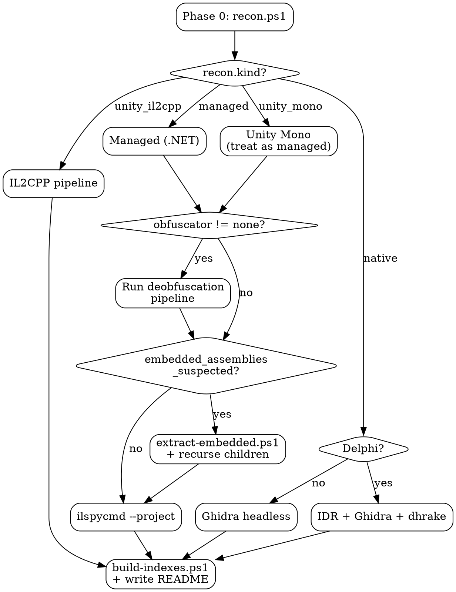

# Decompilation Skill

Recon first, route by binary type, preserve every intermediate artifact.
Produce structured, AI-navigable output that another agent can grep/explore efficiently.

---

## Phase 0 — Recon (Always First)

Run recon before any decompilation. Never assume binary type from filename.

```powershell
# From skill root:
& ./scripts/recon.ps1 "<target-path>"
```

**Read output:** `recon.json` placed next to target.

| Field | Values |
|---|---|
| `kind` | `managed`, `native`, `unity_mono`, `unity_il2cpp`, `mixed`, `unknown` |
| `obfuscator` | `ConfuserEx 2`, `Eazfuscator`, `SmartAssembly`, `none`, ... |
| `next_phase` | `dotnet_deobfuscate`, `native_decompile`, `il2cpp_recover`, `direct_decompile` |

**Exit codes:**
- `0` + recon.json — success
- `1` + stderr — tool missing (`INSTALL_REQUIRED:<tool>`)
- `2` + partial recon.json — fallback heuristics used

**Fallback (DiE not installed):** Script checks PE magic bytes (`MZ`), .NET metadata token `0x424A5342`, resource name patterns. Partial recon.json with `"fallback": true`.

---

## Routing Tree

### Decision Flowchart



### Pseudocode

```python
recon = run_recon(target)

if recon.kind in ("managed", "unity_mono"):
    if recon.obfuscator != "none":
        target = run_obfuscator_pipeline(target, recon.obfuscator)
    if recon.embedded_assemblies_suspected:
        children = extract_embedded(target)
        for child in children:
            recurse(child)
    decompile_to_project(target)  # ilspycmd -p -o ./src

elif recon.kind == "unity_il2cpp":
    il2cpp_dump(target)       # dummy DLLs
    cpp2il_attempt(target)    # partial IL recovery
    ghidra_with_symbols(target)

elif recon.kind == "native":
    if recon.compiler.startswith("Embarcadero Delphi"):
        idr_then_ghidra(target)
    else:
        ghidra_headless(target)

# Always:
build_indexes(out_dir)
write_readme(out_dir)
```

---

## Per-Branch Instructions

### .NET — ConfuserEx
Read `references/dotnet-confuserex.md` for the full staged pipeline, NoFuserEx fast path, and dynamic invoke fallback.

### .NET — Other Obfuscators
Read `references/dotnet-obfuscators.md` for the routing table (Eazfuscator, SmartAssembly, .NET Reactor, Babel.NET, KoiVM, Themida/VMProtect).

### Native — Delphi
Read `references/native-delphi.md` for IDR RTTI extraction, Ghidra + dhrake import, Resource Hacker .dfm forms.

### Native — General (C/C++/Go/Rust)
Read `references/native-general.md` for Ghidra headless analysis, GoReSym, Rust debug sections.

### Unity — IL2CPP
Read `references/unity-il2cpp.md` for Il2CppDumper + Cpp2IL pipeline, Ghidra symbol import.

### Dynamic Analysis (Fallback)
Read `references/dynamic-analysis.md` when static pipeline stalls. Covers Frida, mitmproxy, dnSpyEx, x64dbg.

---

## Output Contract

Every run produces a structured folder. See `references/output-schema.md` for the full spec.

**Key outputs:**

| Artifact | Purpose |
|---|---|
| `original/` | Untouched copy of input |
| `recon.json` | Phase 0 classification |
| `pipeline.log` / `pipeline.json` | What ran, exit codes, timing |
| `intermediate/` | Numbered stages: `01_unpacked`, `02_strings`, ... |
| `extracted/` | Embedded sub-assemblies (recursive) |
| `src/` | Decompiled source (file-per-type) |
| `strings/` | `decrypted.tsv`, `url_candidates.txt`, `all_strings.txt` |
| `metadata/index.json` | Type-to-file map, methods, interfaces |
| `metadata/api_surface.json` | HTTP endpoints, routes, params, returns |
| `README.md` | Pipeline summary |

---

## MUST Rules

1. Run recon first — never assume type from filename
2. Preserve `original/` — always copy before modification
3. Save every intermediate — diagnosable pipeline
4. Use `--project` mode — file-per-type output
5. Build `metadata/index.json` + `api_surface.json`
6. Write `README.md` with pipeline state
7. Log failed steps with exit code + stderr to `pipeline.log`

## MUST NOT Rules

1. Auto-run dynamic invoke on host without user warning (executes target code)
2. Help bypass DRM/licensing on software user doesn't own
3. Silently fail mid-pipeline — every failure must be logged
4. Delete `extracted/` even if extraction looks wrong

## SHOULD Rules

1. Try fast static path first, fall back to dynamic
2. Detect obfuscated sub-assemblies and recurse
3. Log timing per phase
4. Provide `--minimal` mode (recon + strings + decompile only)

---

## Security

**Dynamic invoke warning:** Some deobfuscation steps (ConfuserEx string decryption fallback) execute target code via reflection. Before running any dynamic invoke step:
- STOP and warn the user explicitly
- Recommend running inside a VM or sandbox
- Never proceed without user confirmation

**DRM refusal:** Do not assist with bypassing DRM or licensing protections on software the user does not own. If the target appears to be a DRM-protected commercial product and user lacks ownership, refuse and explain why.

---

## Tool Dependency Check

`scripts/recon.ps1` checks all tools on startup and reports:
- `INSTALL_REQUIRED:<tool>` — blocking, pipeline cannot proceed
- `INSTALL_OPTIONAL:<tool>` — non-blocking, some features degraded

| Category | Tools |
|---|---|
| Required | `diec` (DiE CLI), `ilspycmd`, `strings` |
| Recommended | `de4dot-cex`, `Ghidra` + `analyzeHeadless`, `Il2CppDumper`, `Cpp2IL` |
| Optional | `IDR`, `mitmproxy`, `frida`, `dnSpyEx` |

Read `references/tool-catalog.md` for install commands, URLs, and flags.
